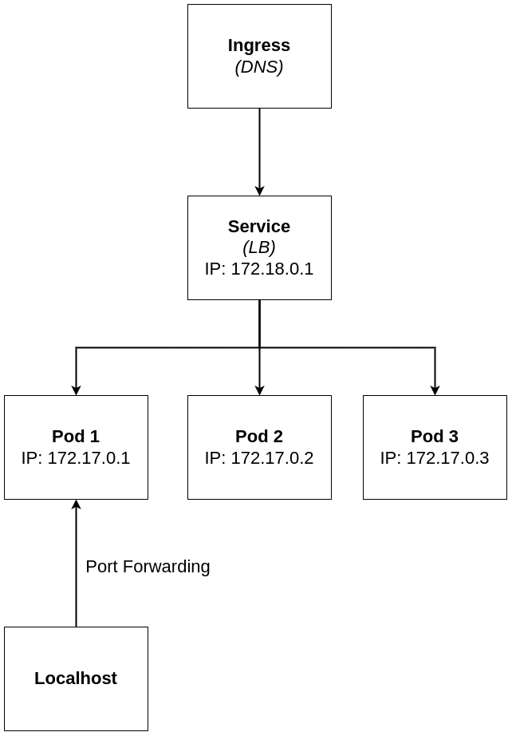

# K8S Networking

## KubeDNS

- Exposed Services automatically register with the k8s internal DNS

- With services exposing themselves on dynamic ports, resolving names can be challenging

- As a solution, a DNS service is included by default in k8s, and this DNS service is updated every time a new service is added

- so DNS name lookup from within one pod to any exposed Service happends automatically

## Network Policies

- By default, all Pods can reach one another

- Network isolation can be configured to block traffic to Pods by running Pods in dedicated namespaces

- `NetworkPolicy` can used to block egress as well as ingress traffic and workds like firewall

- Use of `NetworkPolicy` depends on support form the network provider; not all are offering support and in that case your policy won't have any effect

- Connections are stateful by default; allowing one direction of the traffic is enough

- Labels are used to defined what the policy applies to

- See `kubectl explain NetworkPolicy.spec` for more details

- Policies work with 2 directions: Ingress and Egress

    - If a direction (Ingress or Egress) is listed in the manifest, but not further specified, there is no limitation

    - If a direction is listed and contains a specifiction, that specification will be used

    