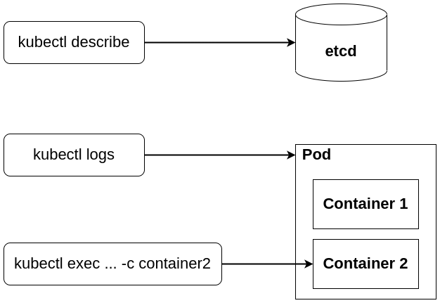

# Pod

- A Pod is an abstraction of a server

- It can run multiple containers within a single NameSpace, exposed by a single IP address

- k8s manage pods, not containers

- Typically, pods are only started through a deployment, because naked pods are not rescheduled in case of node failure


## Multi-Container Pod

- Typically, just one container is offered is offered through a Pod

- Single container Pods are easier to build and maintain

- There some cases where you might want to run multiple containers in a Pod

    - Sidecar container: a container that enhances the primary app, ex: logging

    - Ambassador container: a container that reporesents the primary container to the outside world, ex: proxy

    - Adapter container: used to adopt the traffic or data pattern to match the traffic or data pattern in other apps in the cluster

- Containers in a pod typically share data through shared storage

### Sidecar Scenario

- A sidecar container is providing additional functionality to the main container, where it makes no sense running this functionlity in a separate pod

- Think of loggingg, monitoring, syncing

- The essence is that the main container and the sidecar container have acess to shared resource to exchange info

- Often, shared volumes are used for this purpose


## Namespace

- a Namespace implements kernel level resource isolation

- k8s offers namespace objects that provide the same functionality

- Different Namespace can be used to strictly separate between customer resources

- Use kubectl ... -n ns to work in a specific Namespace

- Use kubectl get ... --all-namespaces to see resources in all namespaces

## Inspecting Pod



- Connect to a pod:
```
kubectl exec -it pod-name -- sh

kubectl exec -it pod-name -c container-name /bin/bash

```

- Port forwarding
```
kubectl port-forward pod/nginx 8080:80
```

## Monitoring

- Use `kubectl get pods` to get an overview of all pods and their current state

- More advanced pod monitoring should happen from the point of view of application monitoring: dont just monitor the individula pod, but the deployment of which it is a part

- Advisor: a more advanced monitoring agent that integrated with kubelet to get performance data about k8s components

- Prometheus: a more advanced monitoring solution that allows u to minitor pods as well as nodes

## Security Context

- a `SecurityContext` defines privilege and access control settings for a pod or container and includes:
    - Discretionary Access Control which is about permissions used to access an object
    
    - Security Enhanced Linux,where security labels can be applied

    - Running as privileged or unprivileged user

    - Using Linux cappabilities

    - AppArmor which is an alternative to SELinux

    - `AllowPrivilegeEscalation` which controls if a process can gain more privileges than its parent process

    