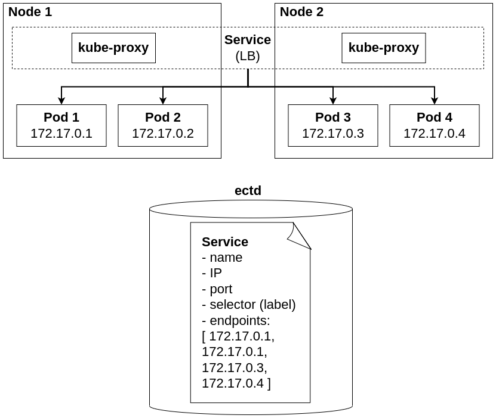

# Service

- a `Service` is an abstraction which defines a logical set of `Pods` and a policy by which to access them

- This together is also referred to as a microservice

- The set of `Pods` that is targeted by a `Service` is __often determined by a selector (which is label)__

- The controller will continuously scan for pods that match the selector and include these in the service

- `Services` exist independently from `Deployments`

- The only thing thay do, is watch for a Deployment that has a specific label set based on the Selector that is specified in the service

- That means that one Service can provide access to multiple deployments, and while doing so, k8s will automatically load balance between these deployments

- the `kube-proxy` agent on the nodes watches the k8s API for new services and endpoints

- After creation, it opens random ports and listens for traffic to the `clusterIp` port and next redirects traffic to the randomly generated service endpoints

### Service Types

- `ClusterIP`: the default type, provieds internal access only

- `NodePort`: allocates a specific node port which needs to be opened on the firewall

- `LoadBalancer`: currently only implementede in public cloud

- `ExternalName`: a relatively new object that works on DNS names; redirections is happening at a DNS level

- Service without selector: use for direct connections based on IP/Port without an endpoint. Useful for connections to database, or between namespaces

## Expose Deployments

- Use `kubectl expose` to expose a current Deployment

- `kubectl expose deployment nginx --port=80 --type=NodePort`

    - Notice this command allocates a random port on all backend nodes, optionally use `targetPort` to define the port taht should be used

- `kubectl get svc` will show current services

- `kubectl get svc nginx -o yaml` will show service specs

